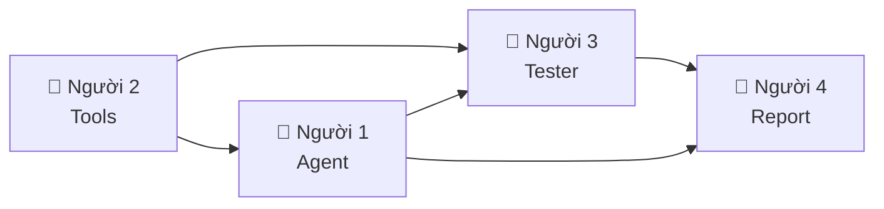

# 🗺️ Vibe Coding Plan — Travel Planner (4 người)

> **Nguyên tắc:** Mỗi người làm file riêng, không đụng file nhau. Cả 4 commit & merge → dự án hoàn chỉnh.

---

## 👤 Người 1 — "Agent Core"

### Files tạo/sửa:
| File | Hành động |
|:---|:---|
| `src/agent/agent.py` | **OVERWRITE** — viết lại hoàn toàn |
| `src/chatbot.py` | **NEW** |

### Task cụ thể:

#### `src/agent/agent.py` — ReAct Agent
- Class `ReActAgent(llm, tools, max_steps=7)`
- Method `get_system_prompt()`:
  - Liệt kê tools từ registry (dùng `from src.tools import get_tool_descriptions`)
  - Hướng dẫn LLM format: `Thought:` → `Action: tool_name(args)` → đợi `Observation:` → lặp → `Final Answer:`
  - Thêm 1 ví dụ few-shot du lịch ngắn gọn
- Method `run(user_input) -> str`:
  - Vòng lặp `while steps < max_steps`:
    1. Gọi `self.llm.generate(prompt, system_prompt)`
    2. Parse output: tìm `Final Answer:` → return. Tìm `Action: tool_name(args)` → gọi tool
    3. Dùng regex: `r'Action\s*:\s*(\w+)\s*\(([^)]*)\)'`
    4. Gọi `from src.tools import execute_tool` → lấy observation
    5. Nối observation vào prompt: `prompt += f"\nObservation: {obs}\n"`
  - Log mỗi step bằng `logger.log_event("AGENT_STEP", {...})`
  - Log metrics bằng `tracker.track_request(provider, model, usage, latency)`

#### `src/chatbot.py` — Chatbot Baseline
- Class `ChatbotBaseline(llm)`
- Method `chat(user_input) -> str`: gọi thẳng `llm.generate()`, không tools, không loop
- Log bằng `logger` và `tracker` giống agent

### Báo cáo cá nhân viết về:
- Technical: implement ReAct loop, regex parsing
- Debug: lỗi parse Action (LLM ra sai format)
- Insight: so sánh kiến trúc loop vs direct call

---

## 👤 Người 2 — "Tool Designer"

### Files tạo:
| File | Hành động |
|:---|:---|
| `src/tools/__init__.py` | **NEW** |
| `src/tools/travel_tools.py` | **NEW** |
| `src/tools/tool_registry.py` | **NEW** |

### Task cụ thể:

#### `src/tools/travel_tools.py` — 6 functions + mock data
Tạo dict dữ liệu giả ở đầu file, rồi viết 6 function:

**Mock data cần tạo:**
```
DESTINATIONS = {"da nang": {...}, "phu quoc": {...}, "sapa": {...}, "hoi an": {...}, "nha trang": {...}}
WEATHER_DATA = {(city, month): {...}}
HOTEL_PRICES = {(city, star): price_per_night}
FOOD_COSTS = {(city, budget_level): cost_per_day}
ATTRACTIONS = {(city, interest): [list]}
```

**6 functions (mỗi cái nhận string, trả string):**

| Function | Input | Output |
|:---|:---|:---|
| `search_destination(city)` | `"Đà Nẵng"` | "Đà Nẵng, miền Trung, biển Mỹ Khê..." |
| `get_weather(city, month)` | `"Đà Nẵng", "6"` | "Tháng 6: 28-35°C, nắng, lý tưởng cho biển" |
| `get_hotel_price(city, star_level, nights)` | `"Đà Nẵng", "3", "3"` | "3 sao: 500k/đêm × 3 = 1,500,000 VNĐ" |
| `estimate_food_cost(city, days, budget_level)` | `"Đà Nẵng", "3", "mid"` | "300k/ngày × 3 = 900,000 VNĐ" |
| `search_attraction(city, interest)` | `"Đà Nẵng", "beach"` | "1. Mỹ Khê (free) 2. Bà Nà (900k)..." |
| `check_budget(total_cost, budget)` | `"3800000", "5000000"` | "Tổng 3.8tr / Ngân sách 5tr → Dư 1.2tr ✅" |

> Quan trọng: mỗi function có docstring mô tả rõ input/output — vì LLM đọc docstring này để biết cách gọi tool.

#### `src/tools/tool_registry.py` — Registry + execute
- List `TOOL_REGISTRY` = 6 dict, mỗi dict có: `name`, `description`, `function`, `args`
- Function `get_tool_descriptions() -> str`: trả chuỗi mô tả cho system prompt
- Function `execute_tool(tool_name, args_str) -> str`: parse args (hỗ trợ JSON + comma-separated) rồi gọi function tương ứng

#### `src/tools/__init__.py`
```python
from src.tools.tool_registry import TOOL_REGISTRY, get_tool_descriptions, execute_tool
```

### Báo cáo cá nhân viết về:
- Technical: thiết kế 6 tools, mock data, argument parsing
- Debug: lỗi LLM hallucinate sai tên tool hoặc sai format argument
- Insight: tầm quan trọng của tool description với khả năng suy luận của agent

---

## 👤 Người 3 — "Tester & Metrics"

### Files tạo/sửa:
| File | Hành động |
|:---|:---|
| `main.py` | **NEW** — runner chính |
| `tests/test_tools.py` | **NEW** — test tools riêng lẻ |
| `tests/test_agent.py` | **NEW** — test agent end-to-end |
| `src/telemetry/metrics.py` | **EDIT** — thêm hàm summarize |

### Task cụ thể:

#### `main.py` — Runner script
- Load `.env`, tạo LLM provider (OpenAI hoặc Gemini tùy key)
- Định nghĩa 5 test cases:
  ```
  1. "Đi Đà Nẵng 3 ngày, ngân sách 5 triệu, thích biển"           (multi-step, agent thắng)
  2. "So sánh Đà Nẵng vs Phú Quốc cho 2 người, 10 triệu"          (complex, agent thắng)
  3. "Thời tiết Sapa tháng 12?"                                     (đơn giản, hòa)
  4. "Đi Hội An 2 ngày, budget 1 triệu, thích văn hóa"             (budget quá thấp, agent cảnh báo)
  5. "Gợi ý chỗ ăn ngon ở Nha Trang"                                (đơn giản, hòa)
  ```
- Chạy từng case qua **Chatbot** và **Agent**, in kết quả
- In bảng so sánh: latency, tokens, steps, đúng/sai
- Lưu kết quả ra `logs/comparison_results.json`

#### `tests/test_tools.py` — Unit test
- Test từng tool riêng lẻ: đúng input → đúng output, sai input → error message
- Dùng `pytest`

#### `tests/test_agent.py` — Integration test
- Test agent với 1-2 câu đơn giản, kiểm tra có trả Final Answer không
- Test max_steps limit

#### `src/telemetry/metrics.py` — Thêm function
- Thêm `summarize() -> dict`: tính trung bình latency, tổng tokens, tổng cost từ `session_metrics`
- Thêm `export_to_json(filepath)`: xuất metrics ra file

### Báo cáo cá nhân viết về:
- Technical: viết test suite, metrics summarize, comparison pipeline
- Debug: phân tích lỗi timeout/infinite loop từ log
- Insight: so sánh số liệu cụ thể Chatbot vs Agent (dùng bảng mình tự thu)

---

## 👤 Người 4 — "Report & Documentation"

### Files tạo/sửa:
| File | Hành động |
|:---|:---|
| `report/group_report/GROUP_REPORT_NHOM15.md` | **NEW** — từ template |
| `report/flowchart.md` | **NEW** — sơ đồ Mermaid |
| `README.md` | **EDIT** — cập nhật hướng dẫn chạy |
| `.env.example` | **EDIT** — cập nhật nếu cần |

### Task cụ thể:

#### `GROUP_REPORT_NHOM15.md`
Dựa theo template, điền đầy đủ 6 mục:
1. **Executive Summary**: tóm tắt success rate, key outcome
2. **System Architecture**: copy flowchart + liệt kê 6 tools + providers dùng
3. **Telemetry Dashboard**: lấy số liệu từ Người 3 (latency P50/P99, tokens, cost)
4. **Root Cause Analysis**: viết 2 case study lỗi (lấy log từ Người 3)
5. **Ablation Studies**: bảng Chatbot vs Agent v1 vs Agent v2
6. **Production Readiness**: guardrails, security, scaling

#### `report/flowchart.md` — Sơ đồ
- Vẽ ReAct loop bằng Mermaid (User → Thought → Action → Tool → Observation → loop hoặc Final Answer)
- Vẽ sơ đồ kiến trúc tổng thể (Provider pattern, Tool Registry)

#### `README.md` — Cập nhật
- Thêm phần "Travel Planner" mô tả use case
- Thêm hướng dẫn chạy `python main.py`
- Thêm danh sách 6 tools

#### Provider switching test
- Chạy agent với OpenAI rồi đổi sang Gemini (hoặc ngược lại)
- Ghi lại so sánh latency/quality vào group report

### Báo cáo cá nhân viết về:
- Technical: viết group report, vẽ flowchart, cập nhật docs
- Debug: so sánh output khác nhau giữa 2 providers
- Insight: đánh giá trade-off giữa providers (giá vs chất lượng vs tốc độ)

---

## 📋 Dependency Map — Ai đợi ai?



| Thứ tự | Ai làm trước | Ai làm sau | Lý do |
|:---|:---|:---|:---|
| 1️⃣ | **Người 2** (Tools) | — | Tools là foundation, ai cũng cần |
| 2️⃣ | **Người 1** (Agent) | Cần tools xong | Agent import tools |
| 2️⃣ | **Người 4** (Flowchart/README) | Làm song song | Docs không phụ thuộc code |
| 3️⃣ | **Người 3** (Test/Metrics) | Cần agent + tools | Chạy test toàn bộ |
| 4️⃣ | **Người 4** (Group Report) | Cần kết quả test | Điền số liệu vào report |

> [!TIP]
> **Người 2 nên commit đầu tiên** (tools) → Người 1 pull & code agent → Người 3 pull cả 2 & chạy test → Người 4 lấy kết quả viết report.

---

## ✅ Checklist merge cuối cùng

Khi cả 4 merge xong, repo phải có:

```
src/
├── agent/
│   └── agent.py                    ← Người 1
├── chatbot.py                      ← Người 1
├── core/                           ← Có sẵn (không ai sửa)
│   ├── llm_provider.py
│   ├── openai_provider.py
│   ├── gemini_provider.py
│   └── local_provider.py
├── telemetry/
│   ├── logger.py                   ← Có sẵn
│   └── metrics.py                  ← Người 3 (edit thêm)
└── tools/
    ├── __init__.py                 ← Người 2
    ├── travel_tools.py             ← Người 2
    └── tool_registry.py            ← Người 2
main.py                             ← Người 3
tests/
├── test_tools.py                   ← Người 3
├── test_agent.py                   ← Người 3
└── test_local.py                   ← Có sẵn
report/
├── group_report/
│   ├── TEMPLATE_GROUP_REPORT.md    ← Có sẵn
│   └── GROUP_REPORT_NHOM15.md     ← Người 4
├── individual_reports/
│   ├── TEMPLATE_INDIVIDUAL_REPORT.md
│   ├── REPORT_[Người 1].md        ← Mỗi người tự viết
│   ├── REPORT_[Người 2].md
│   ├── REPORT_[Người 3].md
│   └── REPORT_[Người 4].md
└── flowchart.md                    ← Người 4
logs/
└── comparison_results.json         ← Người 3 (auto-generated)
README.md                           ← Người 4 (edit)
```
