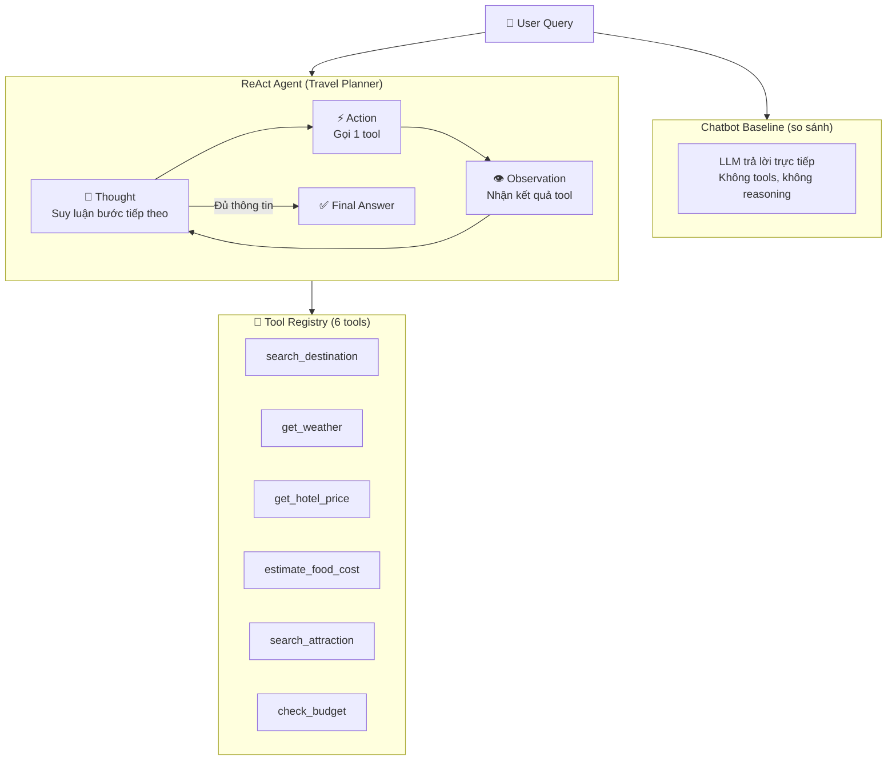

# 🗺️ Travel Planner — System Design (ReAct Pattern)

## Kiến trúc tổng quan

Theo đúng yêu cầu Lab 3, hệ thống gồm **1 ReAct Agent + 1 Chatbot Baseline**, không phải multi-agent.



---

## Tại sao chỉ 1 Agent?

> [!IMPORTANT]
> Lab 3 yêu cầu **ReAct pattern** = 1 agent duy nhất, tự lý luận qua vòng lặp Thought→Action→Observation. Multi-agent là Lab sau. Điểm cao nằm ở chất lượng **trace** và **tool design**, không phải số lượng agent.

---

## 6 Tools thiết kế

### Tool 1: `search_destination(city)`
| Thuộc tính | Chi tiết |
|:---|:---|
| **Input** | `city` (string) — tên thành phố |
| **Output** | Mô tả ngắn, vùng miền, đặc sản, mùa đẹp nhất |
| **Mục đích** | Bước đầu tiên — agent cần biết thông tin cơ bản về điểm đến |
| **Ví dụ** | `search_destination("Đà Nẵng")` → "Đà Nẵng nằm ở miền Trung, nổi tiếng với biển Mỹ Khê, Bà Nà Hills. Mùa đẹp: tháng 3-8. Đặc sản: mì Quảng, bánh tráng cuốn thịt heo." |

### Tool 2: `get_weather(city, month)`
| Thuộc tính | Chi tiết |
|:---|:---|
| **Input** | `city` (string), `month` (string, vd: "6") |
| **Output** | Nhiệt độ, tình trạng thời tiết, khuyến nghị |
| **Mục đích** | Agent kiểm tra thời tiết trước khi gợi ý lịch trình |
| **Ví dụ** | `get_weather("Đà Nẵng", "6")` → "Tháng 6 tại Đà Nẵng: 28-35°C, nắng nhiều, ít mưa. Lý tưởng cho hoạt động biển." |

### Tool 3: `get_hotel_price(city, star_level, nights)`
| Thuộc tính | Chi tiết |
|:---|:---|
| **Input** | `city` (string), `star_level` (string: "3"/"4"/"5"), `nights` (string) |
| **Output** | Giá/đêm, tổng chi phí, tên khách sạn gợi ý |
| **Mục đích** | Ước tính chi phí lưu trú — phần chi phí lớn nhất |
| **Ví dụ** | `get_hotel_price("Đà Nẵng", "4", "3")` → "Khách sạn 4 sao tại Đà Nẵng: ~800,000 VNĐ/đêm. 3 đêm = 2,400,000 VNĐ. Gợi ý: Mường Thanh, Novotel." |

### Tool 4: `estimate_food_cost(city, days, budget_level)`
| Thuộc tính | Chi tiết |
|:---|:---|
| **Input** | `city` (string), `days` (string), `budget_level` (string: "low"/"mid"/"high") |
| **Output** | Chi phí ăn uống/ngày và tổng |
| **Mục đích** | Tính phần ăn uống trong ngân sách |
| **Ví dụ** | `estimate_food_cost("Đà Nẵng", "3", "mid")` → "Ăn uống mức trung bình tại Đà Nẵng: ~300,000 VNĐ/ngày. 3 ngày = 900,000 VNĐ." |

### Tool 5: `search_attraction(city, interest)`
| Thuộc tính | Chi tiết |
|:---|:---|
| **Input** | `city` (string), `interest` (string: "beach"/"culture"/"adventure"/"food") |
| **Output** | Top 3-4 địa điểm + giá vé nếu có |
| **Mục đích** | Gợi ý lịch trình cụ thể theo sở thích |
| **Ví dụ** | `search_attraction("Đà Nẵng", "beach")` → "1. Biển Mỹ Khê (miễn phí) 2. Bà Nà Hills (vé: 900,000 VNĐ) 3. Cù Lao Chàm (tour: 500,000 VNĐ)" |

### Tool 6: `check_budget(total_cost, budget)`
| Thuộc tính | Chi tiết |
|:---|:---|
| **Input** | `total_cost` (string, VNĐ), `budget` (string, VNĐ) |
| **Output** | So sánh + khuyến nghị (đủ/vượt/thừa) |
| **Mục đích** | Bước cuối — agent kết luận có vừa ngân sách không |
| **Ví dụ** | `check_budget("4300000", "5000000")` → "Tổng: 4,300,000 VNĐ. Ngân sách: 5,000,000 VNĐ. Còn dư 700,000 VNĐ ✅" |

---

## Luồng hoạt động mẫu (Test Case chính)

**User:** *"Tôi muốn đi Đà Nẵng 3 ngày, ngân sách 5 triệu, thích biển. Gợi ý lịch trình và tính chi phí."*

```
Step 1 │ Thought: Tôi cần tìm thông tin về Đà Nẵng trước.
       │ Action: search_destination("Đà Nẵng")
       │ Observation: "Đà Nẵng, miền Trung, biển Mỹ Khê, Bà Nà Hills..."
       │
Step 2 │ Thought: User thích biển, tôi check địa điểm phù hợp.
       │ Action: search_attraction("Đà Nẵng", "beach")
       │ Observation: "Mỹ Khê (free), Bà Nà (900k), Cù Lao Chàm (500k)..."
       │
Step 3 │ Thought: Cần tính giá khách sạn 3 đêm, ngân sách trung bình → 3-4 sao.
       │ Action: get_hotel_price("Đà Nẵng", "3", "3")
       │ Observation: "3 sao: 500k/đêm. 3 đêm = 1,500,000 VNĐ"
       │
Step 4 │ Thought: Cần tính chi phí ăn uống.
       │ Action: estimate_food_cost("Đà Nẵng", "3", "mid")
       │ Observation: "300k/ngày, 3 ngày = 900,000 VNĐ"
       │
Step 5 │ Thought: Tổng = khách sạn + ăn + vé tham quan. Kiểm tra ngân sách.
       │ Action: check_budget("3800000", "5000000")
       │ Observation: "Tổng: 3,800,000. Ngân sách: 5,000,000. Dư 1,200,000 ✅"
       │
Step 6 │ Thought: Đủ thông tin, tổng hợp lịch trình.
       │ Final Answer: "Lịch trình 3 ngày Đà Nẵng: Ngày 1: Biển Mỹ Khê..."
```

> Chatbot baseline sẽ **bịa** toàn bộ con số → so sánh trace này rất thuyết phục.

---

## Test Cases (5 câu — dùng cho cả Chatbot và Agent)

| # | Câu hỏi | Chatbot dự kiến | Agent dự kiến |
|:---|:---|:---|:---|
| 1 | "Đi Đà Nẵng 3 ngày 5 triệu, thích biển" | Bịa số, sai giá | Đúng, có breakdown |
| 2 | "So sánh đi Đà Nẵng vs Phú Quốc, 2 người 10 triệu" | Chung chung, không tính | Gọi tool 2 lần, so sánh cụ thể |
| 3 | "Thời tiết Sapa tháng 12?" (câu đơn giản) | Đúng | Đúng — **draw** |
| 4 | "Đi Hội An 2 ngày, budget 1 triệu, thích văn hóa" | Bịa, không cảnh báo vượt ngân sách | Agent cảnh báo: budget quá thấp |
| 5 | "Đặt khách sạn 5 sao Nha Trang" (tool không có) | Trả lời chung | Agent phải biết giới hạn |

---

## Phân công theo design này

| Người | Việc theo design |
|:---|:---|
| **Người 1** | Implement ReAct loop trong `agent.py` + chatbot baseline |
| **Người 2** | Code 6 tools + mock data + tool registry |
| **Người 3** | Chạy 5 test cases, thu log, tạo bảng so sánh metrics  |
| **Người 4** | Vẽ flowchart, viết group report, test provider switching |
